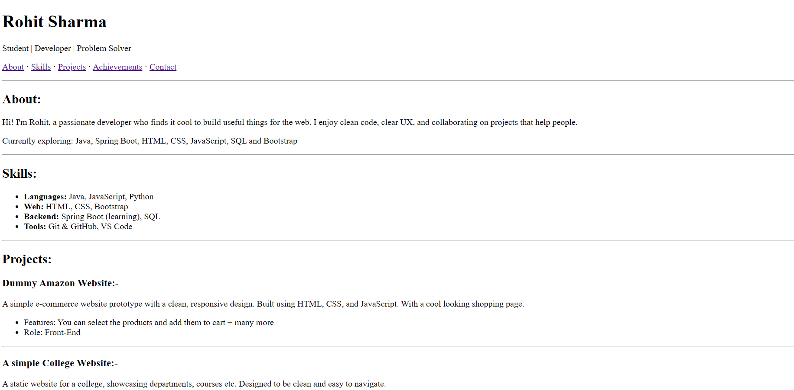

# HTML-Only Portfolio

A lightweight, single-file personal portfolio built entirely with **pure HTML** — no CSS, no JavaScript.  
This site showcases sections like **About**, **Skills**, **Projects**, **Achievements**, **Education**, and **Contact**, all in a simple and portable format.

## 📌 Features
- 100% HTML — works in any browser without extra setup  
- Lightweight and fast-loading  
- Clear, semantic structure for accessibility  
- Easy to customize text, links, and content  
- Ready for deployment on GitHub Pages or any static hosting service  

## 🚀 Deployment
1. Fork or clone this repository.  
2. Edit `index.html` with your personal information.  
3. Commit and push the changes.  
4. Enable **GitHub Pages** in the repository settings (`Settings → Pages → Branch: main`).  
5. Your live site will be available at:  
   ```
   https://<your-username>.github.io/<repository-name>
   ```

## 🖼 Screenshot
  
*Replace `screenshot.png` with your own screenshot of the portfolio.*

## 🛠 Customization
- Replace placeholder text in `index.html` with your own details.  
- Add images by placing them in the repo and linking like:
  ```html
  
  ```
- You can later enhance it with CSS for styling or JavaScript for interactivity.

## 📄 License
This project is licensed under the [MIT License](LICENSE).

---
💡 *This portfolio is intentionally minimal — perfect for beginners and as a starting point for more advanced designs.*
